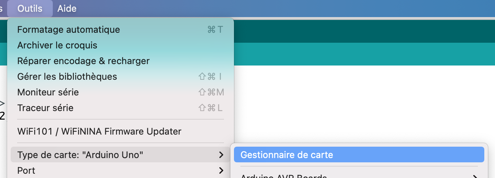
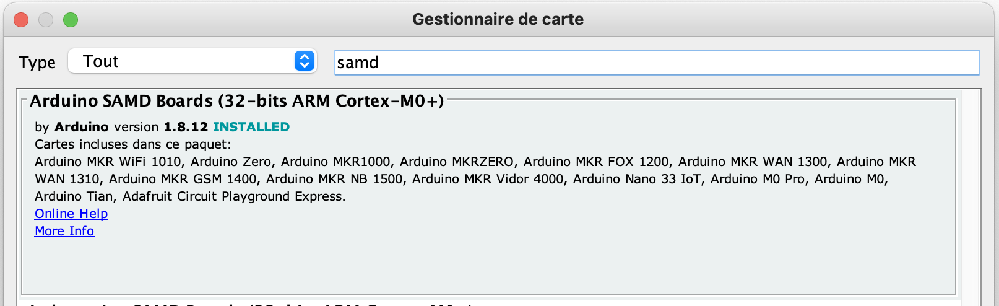
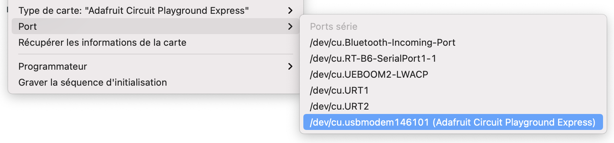
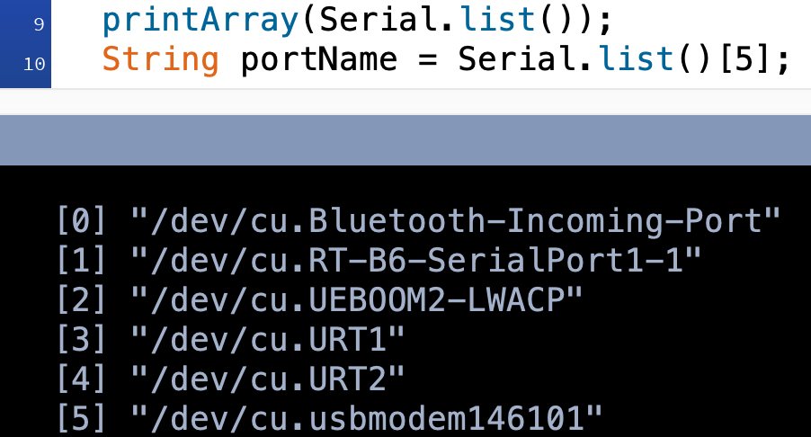

# Communication entre la Circuit Playground Express et Processing

**Ou comment créer une communication série entre la carte Circuit Playground Express d'Arduino, et Processing, notamment en récupérant les valeurs des capteurs capacitifs de la carte.**

## Arduino

Pour utiliser la carte CPX dans Arduino, il faut télécharger le gestionnaire de cartes "Arduino SAMD Boards" en passant par Outils > Gestionnaire de carte.





Dans les Outils, on choisit ensuite la carte Circuit Playground Epxress dans `Type de carte` et on choisit le bon port dans la liste.



Il suffit ensuite d'ajouter la ligne `#include <Adafruit_CircuitPlayground.h>` au début du code, et ajouter la ligne `CircuitPlayground.begin();` dans le setup().

<details>
  <summary> ▶️ Code Arduino : CCPX_comm_ino.ino </summary>

  ```java
#include <Adafruit_CircuitPlayground.h>

int threshold;

void setup() {
  Serial.begin(9600);
  CircuitPlayground.begin();
}

void loop() {  
  int valeur = 0;
  threshold = 900;

  //capteur 6 = A1
  if (CircuitPlayground.readCap(6) > threshold) {
    valeur = 1;
    delay(10);
  }

  //capteur 9 = A2
  if (CircuitPlayground.readCap(9) > threshold) {
    valeur = 2;
    delay(10);
  }

  //capteur 10 = A3
  if (CircuitPlayground.readCap(10) > threshold) {
    valeur = 3;
    delay(10);
  }

  //capteur 3 = A4
  if (CircuitPlayground.readCap(3) > threshold) {
    valeur = 4;
    delay(10);
  }

  //capteur 2 = A5
  if (CircuitPlayground.readCap(2) > threshold) {
    valeur = 5;
    delay(10);
  }

  //capteur 0 = A6
  if (CircuitPlayground.readCap(0) > threshold) {
    valeur = 6;
    delay(10);
  }

  //capteur 1 = A7
  if (CircuitPlayground.readCap(1) > threshold) {
    valeur = 7;
    delay(10);
  }

  Serial.write(valeur);

}
``` 

</details>

Dans le setup(), on commence par démarrer la communication série avec `Serial.begin(9600);` et on lance la carte avec `CircuitPlayground.begin();`.

Dans le loop(), on met par défaut la valeur envoyée en série à 0 avec la ligne `int valeur = 0;`.

Ensuite, on compare la valeur reçue de chacun des capteurs avec la valeur `threshold` que l'on définit dans le loop() et qui est la valeur minimum de détection que les capteurs sont touchés.

Les valeurs des capteurs vont de 0 à 1024, avec une valeur "ambiante" qui est souvent entre 200 et 400, et le `threshold` doit être adapté en fonction des résultats obtenus dans le moniteur série quand on teste les connexions.

Les capteurs capacitifs de la carte sont de A1 à A7, mais sont codés dans le code comme :
- A1 = 6
- A2 = 9
- A3 = 10
- A4 = 3
- A5 = 2
- A6 = 0
- A7 = 1

On récupère donc leur valeur dans le code arduino avec `CircuitPlayground.readCap(1)` pour A7 par exemple.

Avec la ligne `Serial.write(valeur);`, on envoie en série la valeur détectée des capteurs capacitifs, qui sera reçue dans Processing.

## Processing

Grâce à la ligne `printArray(Serial.list());`, on écrit dans la console la liste des ports, avec ici le port [5] qui correspond à celui auquel est connectée la carte dans Arduino.

On modifie donc la ligne `String portName = Serial.list()[5];`, qui permet de définir le port de la connexion série entre Arduino et Processing, pour que ça soit donc bien le port de la carte.



<details>
  <summary> ▶️ Code Processing : CCPX_comm.pde </summary>

  ```java
import processing.serial.*;

Serial myPort;  // Create object from Serial class
float val;      // Data received from the serial port

void setup()
{
  size(500, 500);
  printArray(Serial.list());
  String portName = Serial.list()[5];

  myPort = new Serial(this, portName, 9600);
}

void draw()
{
  if ( myPort.available() > 0) {  // If data is available,
    val = myPort.read();         // read it and store it in val
  }

  println(val);
  noStroke();
  fill(0, 10);
  rect(0, 0, width, height);

  if (val == 1) {
    fill(250, 50, 50);
    rect(10, 20, 50, 50);
  }

  if (val == 2) {
    fill(50, 250, 50);
    rect(200, 250, 50, 50);
  }

  if (val == 3) {
    fill(50, 50, 250);
    rect(260, 310, 50, 50);
  }

  if (val == 4) {
    fill(0, 50, 70);
    rect(310, 350, 50, 50);
  }

  if (val == 5) {
    fill(20, 0, 150);
    rect(50, 50, 50, 50);
  }

  if (val == 6) {
    fill(10, 180, 0);
    rect(200, 10, 50, 50);
  }

  if (val == 7) {
    fill(10, 250, 250);
    rect(310, 100, 50, 50);
  }
}

``` 

</details>

